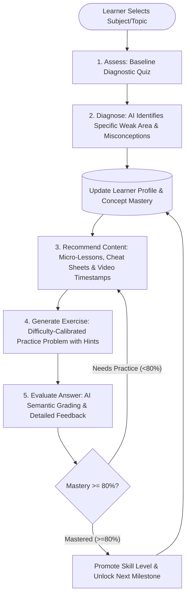
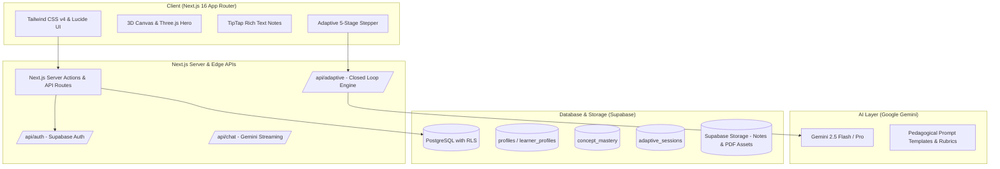

# 🧠 Siksha Copilot — Adaptive Learning System & Digital Study Hub

[](https://nextjs.org/)
[](https://ai.google.dev/)
[](https://supabase.com/)
[](https://www.typescriptlang.org/)
[](https://tailwindcss.com/)

> **Siksha Copilot** is an intelligent AI-driven learning platform designed to replace one-size-fits-all education with an individualized, closed-loop pedagogical journey. By actively maintaining a dynamic **Learner Profile**, the system assesses concept comprehension, diagnoses root-cause weaknesses, curates targeted micro-content, synthesizes calibrated practice problems, and evaluates learner submissions in real-time.

---

## 📑 Table of Contents
- [1. Executive Overview](#1-executive-overview)
- [2. The 5-Step Adaptive Closed-Loop Flow](#2-the-5-step-adaptive-closed-loop-flow)
- [3. Learner Profile & Mastery Modeling](#3-learner-profile--mastery-modeling)
- [4. System Architecture](#4-system-architecture)
- [5. Database Schema & Data Models](#5-database-schema--data-models)
- [6. API Specifications](#6-api-specifications)
- [7. Interactive UI & Features](#7-interactive-ui--features)
- [8. Getting Started](#8-getting-started)
- [9. Roadmap & Vision](#9-roadmap--vision)

---

## 1. Executive Overview

Traditional e-learning platforms present static playlists of videos and questions, forcing learners through identical curricula regardless of prior knowledge or learning velocity. 

**Siksha Copilot** transitions learning from **passive content consumption** to **active, adaptive problem solving**.

```
  ┌──────────────────────────────────────────────────────────────┐
  │                 5-STEP ADAPTIVE LEARNING LOOP                │
  │                                                              │
  │   [ 1. ASSESS ] ───────► [ 2. IDENTIFY WEAK AREA ]           │
  │          ▲                               │                   │
  │          │                               ▼                   │
  │   [ 5. EVALUATE ANSWER ] ◄─── [ 4. GENERATE EXERCISE ]       │
  │          │                               ▲                   │
  │          └──────────► [ 3. RECOMMEND CONTENT ] ──────────────┘
  └──────────────────────────────────────────────────────────────┘
```

### Key Pillars
1. **Dynamic Cognitive Profiling**: Continuous tracking of mastery scores ($0-100\%$) across granular sub-concepts.
2. **Pedagogical Diagnostic Engine**: Identifies whether errors stem from conceptual gaps, calculation slips, or prerequisite deficiencies.
3. **Just-in-Time Micro-Learning**: Delivers bite-sized explanations, high-yield formula summaries, and timestamped video excerpts.
4. **Calibrated Exercise Synthesis**: Uses Google Gemini to generate novel, difficulty-tuned exercises with scaffolded hints.
5. **Formative Feedback & Rubric Evaluation**: Instant, conversational grading with actionable remediation recommendations.

---

## 2. The 5-Step Adaptive Closed-Loop Flow



### Step 1: Assess (Baseline Diagnostic Quiz)
- **Goal**: Measure baseline understanding without overwhelming the learner.
- **Mechanism**: Presents 3–5 targeted questions spanning foundational concepts and edge-cases.
- **Output**: Initial confidence and accuracy matrix across tested concepts.

### Step 2: Identify Weak Area (AI Diagnosis)
- **Goal**: Pinpoint the precise cognitive failure point.
- **Mechanism**: The AI analyzes incorrect options and learner rationale to distinguish between:
  - *Prerequisite Deficit*: Lack of foundational knowledge (e.g., struggling with integration due to weak algebraic factorization).
  - *Conceptual Misunderstanding*: Flawed mental model (e.g., confusing velocity with acceleration).
  - *Procedural Error*: Knowing the theory but failing execution.
- **Output**: Diagnosis tag (e.g., `Base Case Termination in Recursion`, `Confidence: 0.88`).

### Step 3: Recommend Content (Targeted Remediation)
- **Goal**: Provide concise, high-impact instruction to resolve the diagnosed weakness.
- **Mechanism**: Curates multi-modal learning material:
  - **Quick Read**: Concise 2-minute micro-lesson focusing strictly on the gap.
  - **Visual Aids**: Mathematical equations in KaTeX, memory hooks, and algorithmic diagrams.
  - **Targeted Video**: Embedded YouTube clips queued to the exact explanatory timestamp.

### Step 4: Generate Exercise (Calibrated Practice)
- **Goal**: Reinforce the remediated concept through targeted problem solving.
- **Mechanism**: Gemini generates a dynamic, novel question calibrated to the learner's current zone of proximal development (ZPD):
  - **Tiered Difficulty**: Easy, Medium, Hard, or Multi-step Olympiad.
  - **Scaffolded Hints**: 3 progressive hints that can be revealed step-by-step without spoiling the final answer.
  - **Internal Rubric**: Hidden criteria detailing necessary steps and deduction conditions.

### Step 5: Evaluate Answer (Rubric-Based AI Grading)
- **Goal**: Deliver constructive, non-punitive formative feedback.
- **Mechanism**: The student submits a code snippet, mathematical derivation, or textual answer. Gemini evaluates the response against the rubric:
  - Identifies correct intuition, partial steps, and misconceptions.
  - Awards a score delta (e.g., $+25\%$ on concept mastery).
  - Calculates whether the concept status should transition to `improving` or `mastered`.

---

## 3. Learner Profile & Mastery Modeling

The learner profile is a living data structure that tracks cognitive development over time.

```
┌────────────────────────────────────────────────────────┐
│                   LEARNER PROFILE                      │
├────────────────────────────────────────────────────────┤
│  User ID: usr_9f82a1                                   │
│  Target Exam/Level: Engineering Entrance / GATE        │
│  Pace: Accelerated | Learning Style: Visual & Applied  │
├────────────────────────────────────────────────────────┤
│  CONCEPT MASTERY MATRIX:                               │
│  ┌───────────────────────┬─────────┬────────────────┐  │
│  │ Topic / Concept       │ Mastery │ Status         │  │
│  ├───────────────────────┼─────────┼────────────────┤  │
│  │ Recursion - Base Case │   35%   │ Needs Work ⚠️  │  │
│  │ Tree Traversals       │   72%   │ Improving 📈   │  │
│  │ Dynamic Programming   │   15%   │ Untested ⚪    │  │
│  │ Binary Search         │   95%   │ Mastered ⭐    │  │
│  └───────────────────────┴─────────┴────────────────┘  │
│  Historical Sessions: 42 | Streak: 7 Days              │
└────────────────────────────────────────────────────────┘
```

---

## 4. System Architecture



---

## 5. Database Schema & Data Models

The relational schema in Supabase PostgreSQL guarantees data persistence, user isolation, and multi-tenant security via **Row-Level Security (RLS)**:

```sql
-- 1. Concept / Skill Mastery Table
CREATE TABLE public.concept_mastery (
  id UUID DEFAULT gen_random_uuid() PRIMARY KEY,
  user_id UUID REFERENCES auth.users(id) ON DELETE CASCADE NOT NULL,
  subject_name TEXT NOT NULL,
  topic_name TEXT NOT NULL,
  concept_name TEXT NOT NULL,
  mastery_score INTEGER DEFAULT 0 CHECK (mastery_score BETWEEN 0 AND 100),
  status TEXT DEFAULT 'untested' CHECK (status IN ('untested', 'needs_work', 'improving', 'mastered')),
  last_evaluated_at TIMESTAMPTZ DEFAULT NOW(),
  UNIQUE(user_id, topic_name, concept_name)
);

-- 2. Adaptive Learning Sessions (Tracks the 5-step loop)
CREATE TABLE public.adaptive_sessions (
  id UUID DEFAULT gen_random_uuid() PRIMARY KEY,
  user_id UUID REFERENCES auth.users(id) ON DELETE CASCADE NOT NULL,
  topic_name TEXT NOT NULL,
  current_stage TEXT NOT NULL CHECK (current_stage IN ('assess', 'diagnose', 'recommend', 'exercise', 'evaluate', 'completed')),
  diagnostic_summary JSONB DEFAULT '{}'::jsonb,
  identified_weak_areas JSONB DEFAULT '[]'::jsonb,
  recommended_resources JSONB DEFAULT '[]'::jsonb,
  generated_exercise JSONB DEFAULT '{}'::jsonb,
  evaluation_result JSONB DEFAULT '{}'::jsonb,
  created_at TIMESTAMPTZ DEFAULT NOW(),
  updated_at TIMESTAMPTZ DEFAULT NOW()
);

-- 3. Exercise Submissions Log
CREATE TABLE public.exercise_submissions (
  id UUID DEFAULT gen_random_uuid() PRIMARY KEY,
  session_id UUID REFERENCES public.adaptive_sessions(id) ON DELETE CASCADE,
  user_id UUID REFERENCES auth.users(id) ON DELETE CASCADE NOT NULL,
  concept_name TEXT NOT NULL,
  question_text TEXT NOT NULL,
  submitted_answer TEXT NOT NULL,
  is_correct BOOLEAN NOT NULL,
  score_awarded INTEGER CHECK (score_awarded BETWEEN 0 AND 100),
  ai_feedback TEXT NOT NULL,
  created_at TIMESTAMPTZ DEFAULT NOW()
);

-- Enable Row Level Security
ALTER TABLE public.concept_mastery ENABLE ROW LEVEL SECURITY;
ALTER TABLE public.adaptive_sessions ENABLE ROW LEVEL SECURITY;
ALTER TABLE public.exercise_submissions ENABLE ROW LEVEL SECURITY;

-- User Isolation Policies
CREATE POLICY "Users can only access own mastery"
  ON public.concept_mastery FOR ALL
  USING (auth.uid() = user_id);

CREATE POLICY "Users can only access own adaptive sessions"
  ON public.adaptive_sessions FOR ALL
  USING (auth.uid() = user_id);
```

---

## 6. API Specifications

### `POST /api/adaptive/assess`
Generates a baseline diagnostic quiz for a specific topic.
```json
// Request Body
{
  "topic": "Recursion & Backtracking",
  "difficulty": "introductory"
}

// Response
{
  "sessionId": "ses_489af2",
  "questions": [
    {
      "id": "q1",
      "question": "What is the primary function of a base case in a recursive algorithm?",
      "options": [
        "A) Accelerate memory allocation",
        "B) Terminate recursion and prevent stack overflow",
        "C) Multiply the returned values",
        "D) Convert recursive calls into an iterative loop"
      ],
      "conceptTested": "Base Case Termination"
    }
  ]
}
```

---

### `POST /api/adaptive/diagnose`
Evaluates quiz results to isolate misconceptions and weak areas.
```json
// Request Body
{
  "sessionId": "ses_489af2",
  "answers": [
    { "questionId": "q1", "selectedOption": "A" }
  ]
}

// Response
{
  "weakAreas": [
    {
      "concept": "Base Case Termination",
      "severity": "critical",
      "diagnosis": "Learner attributes memory efficiency to base conditions instead of call-stack termination logic.",
      "prerequisiteMissing": "Call Stack Execution Mechanics"
    }
  ]
}
```

---

### `POST /api/adaptive/recommend`
Fetches and generates contextual micro-lessons, formula summaries, and video clips.
```json
// Request Body
{
  "concept": "Base Case Termination",
  "weakAreaDiagnosis": "Call Stack Execution Mechanics"
}

// Response
{
  "microLesson": "Every recursive invocation places a new stack frame on the call stack. Without a base case to trigger returns, stack overflow occurs...",
  "formulaNotes": ["Stack Depth = O(N) in unoptimized recursion", "Always check base case condition before recurrence logic"],
  "videoRecommendation": {
    "title": "Recursion Visualized with Stack Frames",
    "timestampSeconds": 145,
    "url": "https://www.youtube.com/watch?v=..."
  }
}
```

---

### `POST /api/adaptive/generate-exercise`
Produces a dynamically generated practice challenge with scaffolded hints.
```json
// Request Body
{
  "concept": "Base Case Termination",
  "targetDifficulty": "medium"
}

// Response
{
  "exerciseId": "ex_904",
  "prompt": "Identify the bug in the following factorial function and correct the base condition so that it computes 0! correctly without infinite recursion.",
  "codeSnippet": "def factorial(n):\n    if n == 1:\n        return 1\n    return n * factorial(n - 1)",
  "hints": [
    "Consider the mathematical definition of 0!",
    "What occurs if factorial(0) is executed with the current check?",
    "Add a condition covering n <= 1."
  ]
}
```

---

### `POST /api/adaptive/evaluate`
Performs semantic grading on the submitted response and returns mastery adjustment.
```json
// Request Body
{
  "exerciseId": "ex_904",
  "userSubmission": "Change condition to if n <= 1: return 1",
  "concept": "Base Case Termination"
}

// Response
{
  "isCorrect": true,
  "score": 100,
  "masteryDelta": 30,
  "newMasteryScore": 78,
  "feedback": "Excellent! Your base condition accurately captures both 0! = 1 and handles negative input safely.",
  "nextAction": "advance_to_tree_recursion"
}
```

---

## 7. Interactive UI & Features

In addition to the adaptive engine, **Siksha Copilot** features a full digital study environment:

- 🎮 **3D Hero Scene**: Interactive canvas rendered with `@react-three/fiber` and `@react-three/drei`.
- 📝 **Rich-Text Notes Editor**: Collaborative markdown and WYSIWYG notes powered by **TipTap**, KaTeX mathematical formulas, and typography extensions.
- ⏱️ **Pomodoro & Focus Tracker**: Integrated study timer with deep-work session logging and weekly analytics.
- 📺 **Educational YouTube Hub**: In-app search and distraction-free playback for academic lectures.
- 💬 **Gemini Study Chatbot**: Embedded persistent AI study companion for real-time doubts resolution.
- 🌓 **Dynamic Theme Engine**: Seamless light and dark mode toggling using `next-themes` and Tailwind CSS v4.

---

## 8. Getting Started

### Prerequisites
- Node.js `18.18+` or `20+`
- A free [Supabase](https://supabase.com/) project
- A free [Google AI Studio](https://aistudio.google.com/) Gemini API Key

### Installation

1. **Clone the Repository**:
   ```bash
   git clone https://github.com/Abhijeet-nigam03/siksha-copilot-docs.git
   cd siksha-copilot-docs
   ```

2. **Configure Environment Variables**:
   Create a `.env.local` file with the following keys:
   ```env
   # Google Gemini AI
   GOOGLE_GENERATIVE_AI_API_KEY=your_gemini_api_key_here

   # Supabase Configuration
   NEXT_PUBLIC_SUPABASE_URL=https://your-project.supabase.co
   NEXT_PUBLIC_SUPABASE_ANON_KEY=your_supabase_anon_key_here
   ```

3. **Set Up Supabase Database**:
   Run the SQL statements from [Section 5](#5-database-schema--data-models) in the Supabase SQL Editor.

4. **Run the Project**:
   ```bash
   npm run dev
   ```
   Open [http://localhost:3000](http://localhost:3000) in your browser.

---

## 9. Roadmap & Vision

- [x] Initial Digital Study Hub with Notes, Timer, and Video Player
- [x] Architecture & Specifications for 5-Step Adaptive Engine
- [ ] Automated Item Response Theory (IRT) difficulty scoring
- [ ] Spaced repetition scheduling using SuperMemo-2 (SM-2) algorithm
- [ ] Multi-student collaborative peer-review workshops
- [ ] Exportable cognitive learning portfolios and mastery certificates

---

## 👥 Author & Acknowledgements
- **Author**: Abhijeet Nigam ([@Abhijeet-nigam03](https://github.com/Abhijeet-nigam03))
- Built with **Next.js**, **Google Gemini**, and **Supabase**.
